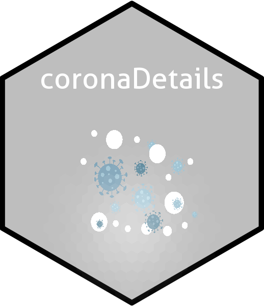

<!-- README.md is generated from README.Rmd. Please edit that file -->

# coronaDetails 

<!-- badges: start -->

<!-- badges: end -->

The goal of coronaDetails is to plot of coronaviruce and updating data

## Installation

The development version from [GitHub](https://github.com/) with:

``` r
# install.packages("devtools")
devtools::install_github("zahradm/coronaDetails")
```

## Example

The newdata() function get data from Johns Hopkins University and output
is a csv file that contains number of confirmed and death cases

The map(type,date) function output is a map of world that shows distribution of coronaviruce cases

The timeseries(start,end,country) function output ia a line plot 
